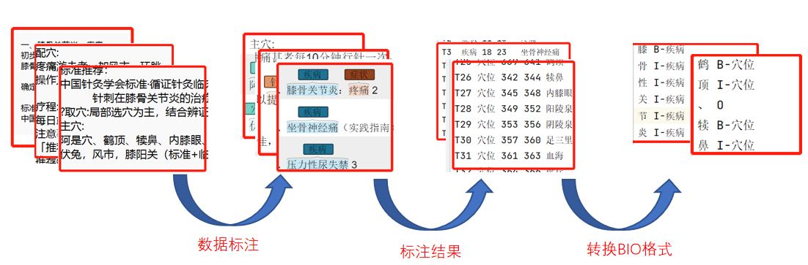
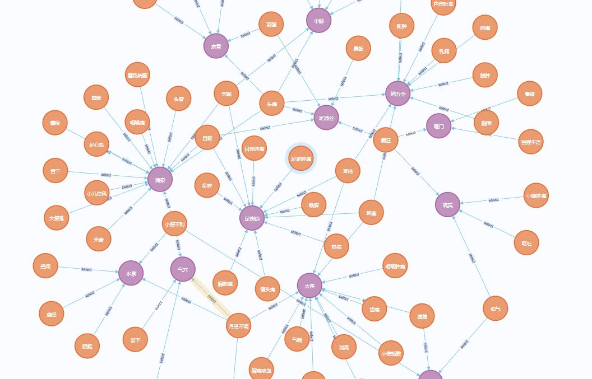
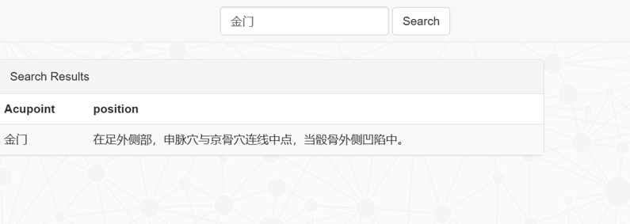

##  基于医疗知识图谱的自动问答系统
### 2.2 脚本结构
question_classifier.py：问句类型分类脚本
answer_search.py：查询语句、回复模板
chatbot_graph.py：默认回答和报错示范
question_parser.py：不同问题分开解析

### 2.3 支持问答类型

| 问句类型 | 中文含义 |    问句举例    |
| :--- | :---: |:----------:|
| disease_cureway | 治疗方式 |  头痛要怎么治？   |
| acupoint-disease| 穴位能治啥病| 太溪穴治疗什么疾病？ |

### 结果展示
对中医针灸中的穴位、症状等实体进行了详细的数据标注，确保了数据的专业性和高质量。结合权威文献和权威论文的支持，完成了多层次的实体标注，涵盖了症状与穴位间的关联，为后续的知识图谱构建和问答系统提供了扎实的基础。
同时通过学习后的爬虫技术，从中医中药网其中的针灸相关内容进行了数据的爬取，然后通过数据解析技术xpath进行信息的提取，然后对提取到的数据进行进一步的处理，比如无关字符的剔除，比如词语之间存在的空格以及换行等无关内容，然后对处理后的数据存入MongoDB数据库中，方便后续数据的处理。从网站上爬取的数据需要包含的内容为：穴位名称、疾病名称、穴位的属性位置。
数据库构建：基于标注数据，建立了涵盖针灸医学知识的独立数据库，数据存储采用标准化的JSON格式，确保系统读取和使用的便利性与兼容性。数据处理过程中，通过爬虫和手工标注相结合，严格保证了数据的准确性，并进行必要的数据清洗和格式转换，进一步提升了数据的标准化程度。
由于提取到的数据是存放与MongoDB数据库中的，此时需要将其转换为JSON格式的数据，所以此时需要编写python脚本将MongoDB数据库中的数据存储到JSON格式的数据文件中，将其用于后续知识图谱的构建数据。

知识图谱构建：建立了以穴位、症状、治疗方法为核心的知识图谱，知识图谱通过图数据库Neo4j进行存储与管理，使得不同实体间的关联关系更加直观，便于快速查询和信息提取。最终创建的知识图谱如图所示。

问答模块展示

定位模块展示
